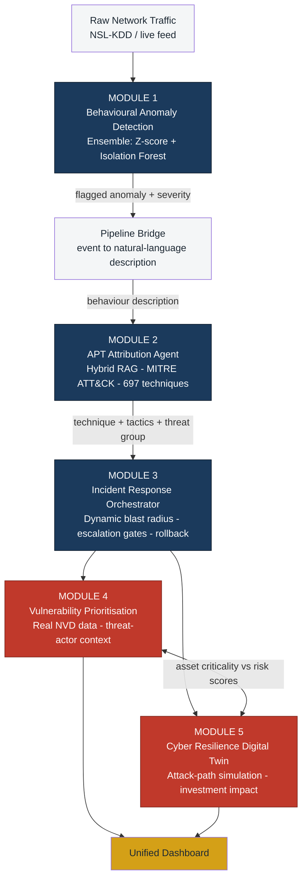

# 🛡️ Cyber Sentinel CNI

**AI-Driven Cyber Resilience for Critical National Infrastructure**


> A behavioural intelligence platform that detects cyber threats to critical infrastructure **without relying on known malware signatures** — compressing detection-to-response time from weeks to minutes.

Built solo for **ET AI Hackathon 2026 — Problem Statement 7**.

---

## 📋 Table of Contents
- [Overview](#-overview)
- [Architecture](#-architecture)
- [Modules & Progress](#-modules--progress)
- [Key Results](#-key-results)
- [Tech Stack](#-tech-stack)
- [Project Structure](#-project-structure)
- [Getting Started](#-getting-started)
- [Datasets](#-datasets)
- [Research Findings](#-research-findings-roadmap-investigations)

---

## 🎯 Overview

Critical national infrastructure — power grids, government systems, financial networks — faces attackers who deliberately operate "low and slow" to evade signature-based detection. CERT-In reported handling over **1.59 million cybersecurity incidents in 2023** alone, with most breaches discovered only weeks or months after initial compromise.

**Cyber Sentinel CNI** addresses this with a behavioural intelligence layer that:
1. Learns what *normal* network behaviour looks like — no attack signatures needed
2. Flags deviations in real time and explains *why* they're suspicious
3. Maps flagged behaviour to the **MITRE ATT&CK** framework to identify attacker techniques, likely next moves, and known threat actor associations
4. Auto-contains low-risk incidents while escalating high-risk ones to a human, with full auditability
5. Prioritizes vulnerability remediation using real CVE data contextualized by asset criticality and active threat-actor targeting
6. Simulates attack paths and security-investment impact on a digital twin — without touching live systems

All **five** capabilities named in the official problem statement are fully implemented, cross-integrated, and evaluated with real data — not five isolated demos.

---

## 🏗️ Architecture



Modules 1→2→3 run as a proven, tested live pipeline. Modules 4 and 5 cross-reference each other's real data (asset criticality, threat-actor context, vulnerability scores) rather than operating in isolation — for example, Module 3's blast-radius calculation for an action on `SCADA-01` multiplies the action's base disruption score by that asset's **real** criticality value pulled directly from Module 4's inventory.

---

## 📦 Modules & Progress

```mermaid
gantt
    title Build Timeline (Day 1 - Day 8)
    dateFormat  X
    axisFormat Day %s
    section Foundation
    Scope + datasets           :done, d0, 0, 1
    section Modules
    Module 1 - Anomaly Detection      :done, m1, 1, 3
    Module 2 - APT Attribution        :done, m2, 3, 5
    Module 3 - Incident Response      :done, m3, 5, 7
    Module 4 - Vulnerability Priority :done, m4, 7, 8
    Module 5 - Digital Twin           :done, m5, 8, 9
    Dashboard + research deep-dives   :done, m6, 9, 10
```



| # | Module | Status | Depth |
|---|--------|--------|-------|
| 1 | **Behavioural Anomaly Detection Engine** | ✅ Complete | Ensemble model, statistical baseline comparison, rigorous evaluation |
| 2 | **APT Campaign Attribution & Prediction Agent** | ✅ Complete | Hybrid RAG, quantitatively evaluated, campaign narrative builder |
| 3 | **Autonomous Incident Response Orchestrator** | ✅ Complete | Dynamic blast radius, confidence gating, rollback, campaign correlation |
| 4 | **Government Infrastructure Vulnerability Prioritisation** | ✅ Complete | Real NVD data, threat-actor context, capacity-constrained scheduling |
| 5 | **Cyber Resilience Digital Twin** | ✅ Complete | Attack-path simulation, choke-point analysis, investment impact testing |
| — | **Unified Dashboard** | ✅ Complete | Streamlit app tying all 5 modules together with live interaction |

See [`docs/SCOPE.md`](docs/SCOPE.md) for full scope and success criteria.

---

## 📊 Key Results

### Module 1 — Anomaly Detection (trained on normal-traffic-only baseline)

| Method | Precision | Recall | F1 | ROC-AUC |
|---|---|---|---|---|
| Statistical Z-score baseline | 0.851 | 0.858 | 0.854 | 0.894 |
| Isolation Forest | 0.974 | 0.648 | 0.778 | 0.939 |
| **Ensemble (final model)** | **0.871** | **0.878** | **0.874** | 0.935 |

**Detection rate by attack category:**
| DoS | Probe | R2L | U2R |
|---|---|---|---|
| 79.3% | 88.3% | 8.6%¹ | 28.4%¹ |

¹ *R2L/U2R attacks are low-volume and behaviourally subtle — a known, documented challenge in NSL-KDD research. Flagged transparently as a limitation and investigated in depth (see [Research Findings](#-research-findings-roadmap-investigations)), not hidden.*

### Module 2 — APT Attribution Agent (RAG over MITRE ATT&CK, 697 techniques)

| Metric | Score |
|---|---|
| Top-1 retrieval accuracy | 62.7% |
| Top-3 retrieval accuracy | **96.0%** |
| Techniques / threat groups / mitigations indexed | 697 / 189 / 268 |

*(Evaluated on 150 held-out technique descriptions — random-chance top-3 accuracy would be ~0.4%.)*

### Module 3 — Incident Response Orchestrator (evaluated on 20 real attack events, full pipeline)

| Metric | Result |
|---|---|
| Attacks detected & responded to (Module 1 → 2 → 3) | 16 / 20 |
| Playbook actions auto-executed | 77.5% |
| Actions correctly escalated to human approval | 22.5% |
| Correlated multi-incident campaigns detected | 5 |
| Compliance audit | **✅ 0 violations** |

Blast radius is **dynamic** — computed from the action's base disruption potential × the *real* criticality of the target asset (pulled from Module 4's inventory), and auto-execution additionally requires high/critical detection confidence, accounting for Module 1's ~80% accuracy.

### Module 4 — Vulnerability Prioritisation (real NVD data: 120,875 CVEs, 2015+)

| Metric | Result |
|---|---|
| CVEs with confirmed active exploitation (CISA KEV) | 840 |
| Asset-vulnerability pairs matched (12-asset CNI inventory) | 60 |
| Pairs boosted by active threat-actor platform relevance | 25 |
| Top-10 overlap: contextualized vs naive CVSS-only ranking | 7/10 |

Risk score combines CVSS-BT (40%) + EPSS (25%) + CISA KEV (20%) + asset criticality (15%), then adjusted by **threat-actor relevance** (cross-referenced against Module 2's attributed campaign using real MITRE malware-platform data) and **unpatched age** (using real CVE publish dates). Output includes a capacity-constrained 6-week remediation schedule, not just a static list.

### Module 5 — Cyber Resilience Digital Twin

| Scenario | Critical assets reachable from Internet | Avg. exploit cost |
|---|---|---|
| Baseline (current state) | 5 / 5 | 11.68 |
| IT/OT segmentation only | 2 / 5 | 4.48 |
| Patch top-3 CVEs only | 5 / 5 | 14.28 |
| Segmentation + patching combined | 2 / 5 | 10.98 |

**Network segmentation alone blocks 3 of 5 mission-critical assets completely** (PLC, SCADA, RTU become unreachable) — a bigger impact than patching the top-3 highest-risk CVEs, which makes attacks harder but doesn't fully block anything. Red-team scenario testing further shows that phishing/credential-theft scenarios (R2L category) carry the highest *expected undetected risk* — not because they reach the most assets, but because Module 1 only detects 8.6% of R2L attacks. Risk = reachability × (1 − detection probability), and the twin surfaces that explicitly.

---

## 🛠️ Tech Stack

- **ML/Data:** Python, pandas, scikit-learn (Isolation Forest, Random Forest, TF-IDF), NumPy
- **NLP / Retrieval:** TF-IDF with keyword-boost hybrid; Word2Vec (gensim) investigated and benchmarked
- **Graph analysis:** NetworkX (attack-path simulation, centrality analysis)
- **Threat Intelligence:** MITRE ATT&CK STIX 2.1 Enterprise dataset, CVSS-BT (EPSS + CISA KEV enrichment), NVD CVE descriptions
- **Visualization:** matplotlib, seaborn
- **Dashboard:** Streamlit

---

## 📁 Project Structure

```
cyber-sentinel-cni/
├── README.md
├── docs/
│   └── SCOPE.md                      # Full scope, success criteria, judging alignment
├── data/
│   ├── nsl-kdd/                      # NSL-KDD train/test datasets
│   ├── mitre-cti/                    # MITRE ATT&CK Enterprise STIX bundle
│   ├── cvss-bt/                      # CVE scores + EPSS + CISA KEV enrichment
│   └── cve-offline/                  # CVE descriptions
├── anomaly-detection/                # Module 1
├── attribution-agent/                # Module 2
├── incident-response-orchestrator/   # Module 3
├── vulnerability-prioritization/     # Module 4
├── digital-twin/                     # Module 5
└── frontend/                         # Unified dashboard (Streamlit, app.py)
```

---

## 🚀 Getting Started

```bash
git clone https://github.com/raghav-marda/cyber-sentinel-cni.git
cd cyber-sentinel-cni

# Module 1 — Anomaly Detection
cd anomaly-detection
pip install pandas scikit-learn numpy matplotlib seaborn joblib
python3 preprocess.py
python3 anomaly_model.py
python3 rigorous_evaluation.py

# Module 2 — APT Attribution
cd ../attribution-agent
python3 mitre_parser.py
python3 attribution_agent.py
python3 pipeline_bridge.py
python3 rigorous_evaluation.py

# Module 3 — Incident Response Orchestrator
cd ../incident-response-orchestrator
python3 playbooks.py
python3 orchestrator.py
python3 full_pipeline_evaluation.py

# Module 4 — Vulnerability Prioritisation
cd ../vulnerability-prioritization
pip install pyarrow
python3 cve_loader.py
python3 asset_matcher.py
python3 risk_ranking.py

# Module 5 — Cyber Resilience Digital Twin
cd ../digital-twin
pip install networkx
python3 topology.py
python3 attack_path_simulator.py
python3 investment_impact.py
python3 red_team_scenarios.py
python3 visualize_topology.py

# Unified Dashboard (run after all 5 modules have been executed at least once,
# so their result files exist for the dashboard to load)
cd ../frontend
pip install -r requirements.txt
streamlit run app.py
```

---

## 💾 Datasets

- **[NSL-KDD](https://www.unb.ca/cic/datasets/nsl.html)** — Labelled network intrusion dataset (125,973 train / 22,544 test records)
- **[MITRE ATT&CK](https://attack.mitre.org/)** — Enterprise Matrix, STIX 2.1 format: 697 active techniques, 189 threat groups, 268 mitigations
- **[CVSS-BT](https://github.com/t0sche/cvss-bt)** + NVD CVE descriptions — 120,875 real CVEs (2015+) enriched with EPSS and CISA KEV status

---

## 🔬 Research Findings: Roadmap Investigations

Two "possible improvement" ideas were investigated rigorously rather than left as unverified assumptions — both produced genuine, honestly-reported findings, including negative results.

**Can supervised fine-tuning fix R2L/U2R detection?** A class-weighted Random Forest was trained directly on labelled data to target the weak categories. Result: it made detection *worse* (R2L: 8.6%→5.0%, U2R: 28.4%→13.4%). Root cause: **29.2% of test-set attacks are types never present in training at all** — a deliberate zero-day simulation built into NSL-KDD. A supervised model cannot recognize what it has never seen; the unsupervised behavioural approach generalizes to novel attacks by design. This empirically validates the platform's core architecture rather than exposing a fixable gap.

**Do semantic embeddings beat TF-IDF for MITRE ATT&CK retrieval?** A Word2Vec model was trained from scratch (no internet access to pretrained model hubs from this environment) and tested two ways. On a held-out paraphrase benchmark it scored 92.7% — misleadingly high, since it turned out to be memorizing each technique's unique vocabulary on a small 697-document corpus rather than generalizing. On a second, hand-labeled benchmark of realistic SOC phrasing, it dropped to 15–25% while TF-IDF+keyword-boost held at 45%. **TF-IDF was kept in production.**

Full details: [`anomaly-detection/supervised_r2l_u2r_improvement_summary.json`](anomaly-detection/supervised_r2l_u2r_improvement_summary.json), [`attribution-agent/soc_benchmark_comparison.json`](attribution-agent/soc_benchmark_comparison.json)

---

## 👤 Author

**Raghav Marda** — Solo builder, Amity University Mumbai, Google Student Ambassador 2026

Submission for ET AI Hackathon 2026, Problem Statement 7.
